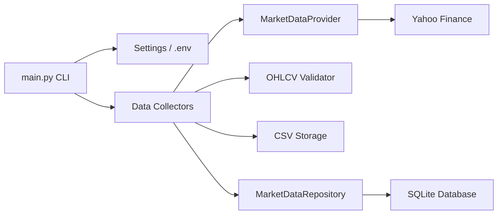

# AI-TRADING-SYSTEM

Phase 1 implementation for a production-grade AI trading platform for Indian stock markets.

This phase includes project structure, configuration, data collection, SQLite persistence, logging, setup scripts, and tests. Later phases should add indicators, features, AI models, backtesting, paper trading, broker integrations, risk management, dashboard, and deployment automation.

## Architecture



## Phase 1 Modules

- `ai_trading_system/config`: typed settings from environment variables.
- `ai_trading_system/data_collection`: historical and live market data collectors.
- `ai_trading_system/database`: SQLite connection, schema initialization, and repositories.
- `ai_trading_system/utils`: logging setup.
- `tests`: unit tests for settings, validation, database schema, and collectors.

## Phase 2 Indicator Architecture

Technical indicators live in the top-level `indicators` package. Each indicator is an OOP class with input validation, type hints, logging, missing-value handling, and a common `add(frame)` method that returns a new `pandas.DataFrame`.

Implemented indicators:

- RSI 14: `rsi_14`
- MACD: `macd`, `macd_signal`, `macd_histogram`
- EMA/SMA: `ema_20`, `ema_50`, `sma_20`, `sma_50`
- ATR 14: `atr_14`
- Bollinger Bands: `bb_middle`, `bb_upper`, `bb_lower`, `bb_width`
- VWAP, volume ratio, daily return: `vwap`, `volume_ratio`, `daily_return`

## Phase 2 Feature Pipeline

Feature engineering lives in the top-level `features` package. `FeatureEngineeringService` validates OHLCV input data, runs the full indicator chain, and produces a model-ready feature dataset.

Generated features:

- RSI, MACD, MACD signal, MACD histogram
- EMA20, EMA50, EMA difference
- SMA20, SMA50, SMA difference
- ATR, Bollinger width, volume ratio, daily return
- Price change %, gap up/down %, volatility

`LabelGenerator` adds:

- `target_next_day_up`: `1` when next close is higher than current close, otherwise `0`
- `target_intraday_direction`: `BUY`, `SELL`, or `HOLD`

`DataQualityValidator` reports null counts, duplicate rows, outlier counts, and missing candles.

## Phase 3 News, Sentiment, Intelligence, And Dashboard

Phase 3 adds live research and monitoring components:

- `news`: collects financial news from Alpha Vantage, Marketaux, Yahoo Finance, and RSS providers.
- `sentiment`: classifies news as `Positive`, `Negative`, or `Neutral` with sentiment and confidence scores.
- `market_intelligence`: generates NIFTY trend, sector trend, gainers, losers, high-volume stocks, gap stocks, volatility, and market health score.
- `dashboard/streamlit_app.py`: Streamlit dashboard with Overview, News, Sentiment, Market Intelligence, and Stock Analysis pages.

News is stored in SQLite table `news_articles` and CSV file `data/news/news.csv`. Sentiment is stored in SQLite table `sentiment_results` and CSV file `data/sentiment/sentiment.csv`.

## Phase 4 AI Training And Prediction

Phase 4 adds model training, registry, prediction, and signal generation:

- `training/dataset_builder.py`: builds datasets from technical, sentiment, and market features.
- `models/random_forest_model.py`: Random Forest train, predict, save, load, and evaluate wrapper.
- `models/xgboost_model.py`: XGBoost train, predict, save, load, and evaluate wrapper.
- `training/model_comparison.py`: compares model metrics and selects the best model.
- `models/model_registry.py`: stores model name, version, training date, metrics, feature set, artifact path, and best-model marker.
- `prediction/prediction_engine.py`: emits `BUY`, `SELL`, or `HOLD` with confidence percentage.
- `signals/signal_generator.py`: applies AI confidence, EMA trend, and sentiment rules.
- `training/train_pipeline.py`: complete train/evaluate/store/report workflow.
- `retraining/automatic_retraining.py`: weekly and monthly retraining support.

Generated reports:

- `reports/training_report.csv`
- `reports/training_report.html`
- `reports/model_performance_report.csv`
- `reports/model_performance_report.html`
- `reports/random_forest_feature_importance.csv`
- `reports/xgboost_feature_importance.csv`
- `reports/latest_prediction.csv`
- `reports/latest_prediction.html`

The dashboard now includes `AI Models` and `Predictions` pages for current model metadata, accuracy, latest predictions, confidence, and top feature importance.

## Setup

Requires Python 3.12.

### Windows

```powershell
cd AI-TRADING-SYSTEM
.\scripts\setup.ps1
```

### Linux / VPS

```bash
cd AI-TRADING-SYSTEM
chmod +x scripts/setup.sh
./scripts/setup.sh
```

## Usage

Initialize the database:

```bash
python main.py --init-db
```

Collect one year of historical OHLCV data:

```bash
python main.py --collect-history --symbol RELIANCE.NS --years 1
```

Collect a live quote snapshot:

```bash
python main.py --collect-live --symbol RELIANCE.NS
```

Create features and labels from an OHLCV DataFrame:

```python
import pandas as pd

from features.feature_engineering import FeatureEngineeringService
from features.label_generator import LabelGenerator

ohlcv = pd.read_csv("data/historical/RELIANCE_NS.csv")
features, validation_report = FeatureEngineeringService().create_feature_dataset(ohlcv)
labeled_features = LabelGenerator().add_labels(features)
print(labeled_features.tail())
print(validation_report)
```

Run the dashboard:

```bash
streamlit run dashboard/streamlit_app.py
```

The dashboard refresh interval defaults to 30 seconds and can be changed from the sidebar or through `DASHBOARD_REFRESH_SECONDS`.

On Windows, double-click `run_dashboard.bat` from the project folder to start Streamlit and open the dashboard automatically in Chrome.

Train models from an OHLCV CSV:

```bash
python main.py --train-models --data-file data/historical/RELIANCE_NS.csv
```

Generate a prediction from the latest registered best model:

```bash
python main.py --predict --data-file data/historical/RELIANCE_NS.csv
```

Collect and analyze news programmatically:

```python
from ai_trading_system.config.settings import get_settings
from ai_trading_system.database.connection import SQLiteConnectionManager
from news.news_collector import AlphaVantageNewsProvider, MarketauxNewsProvider, NewsCollector, RSSNewsProvider, YahooFinanceNewsProvider
from news.news_repository import NewsRepository
from sentiment.sentiment_engine import SentimentEngine
from sentiment.sentiment_repository import SentimentRepository

settings = get_settings()
manager = SQLiteConnectionManager(settings.database_url)
collector = NewsCollector([
    AlphaVantageNewsProvider(settings.alpha_vantage_api_key or ""),
    MarketauxNewsProvider(settings.marketaux_api_key or ""),
    YahooFinanceNewsProvider(),
    RSSNewsProvider(list(settings.rss_feed_urls)),
])
articles = collector.collect(["RELIANCE.NS", "INFY.NS"], limit=25)
NewsRepository(manager).save_many(articles)
results = SentimentEngine().analyze_many(articles)
SentimentRepository(manager).save_many(results)
```

## Configuration

Copy `.env.example` to `.env` and update values as required. Credentials are never hardcoded. News API keys are included for future phases:

- `ALPHA_VANTAGE_API_KEY`
- `MARKETAUX_API_KEY`
- `RSS_FEED_URLS`
- `DASHBOARD_REFRESH_SECONDS`

## Data Storage

Historical data is stored in:

- `data/historical/*.csv`
- `database/trading.db`, table `historical_prices`

Live quote snapshots are stored in:

- `data/live/live_quotes.csv`
- `database/trading.db`, table `live_quotes`

## Testing

```bash
pytest
```

## Production Notes

- Yahoo Finance is included as a research-friendly default provider. For live production trading, add broker-approved market data providers in the same `MarketDataProvider` interface.
- SQLite is the Phase 1 database. PostgreSQL migration can be added later behind repository interfaces.
- All secrets must be supplied through `.env`, environment variables, or a cloud secrets manager.
